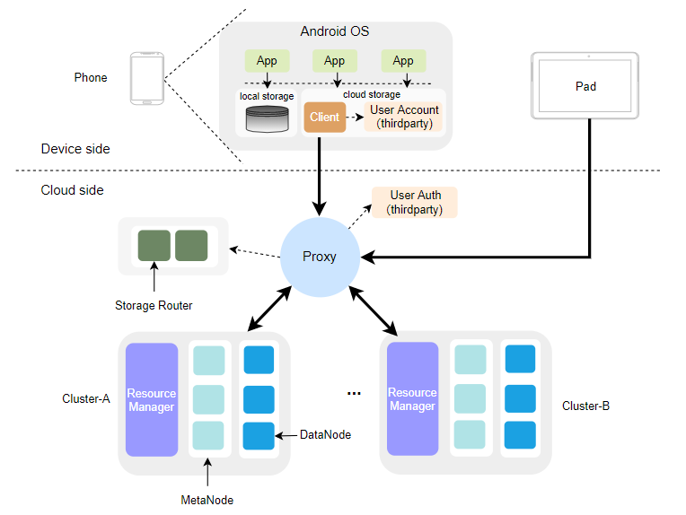

## CubeFS-For-Android

A cloud file system that can be mounted on Android devices. 

## Overview

CFA (CubeFS For Android) provides a mountable cloud file system for mobile devices (including mobile phones, pads, IoT devices, etc.) equipped with Android OS. Some key functions of CFA include:

* Expand the local storage space of user devices.
* Support concurrent access of billion-level devices.
* Support connect to third-party accounts and authentication services.
## Architecture

## Documents

* [Build and deploy CFA server](./docs/deploy-server.md)
* [Build and deploy CFA client](./docs/deploy-client.md)
## Thirdparty developer

* [Thirdparty developer account and authentication specification](./docs/third-auth.md)
## License

CubeFS is licensed under the [Apache License, Version 2.0](http://www.apache.org/licenses/LICENSE-2.0). For detail see [LICENSE](https://github.com/cubefs/cubefs/blob/master/LICENSE) and [NOTICE](https://github.com/cubefs/cubefs/blob/master/NOTICE).

## Note

The current version is the beta version, and we will soon launch the official release version of CFA.

If have any questions, please submit an issue, or contact us in any of the following ways：
* E-mail: 626148589@qq.com
* E-mail: 741773046@qq.com
* WeChat: blkleaf
