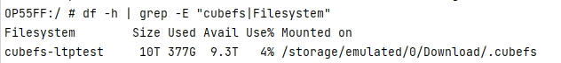
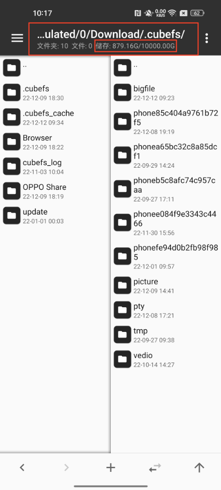

# Code Location

* **Repo:** [cubefs-for-android.git](https://github.com/cubefs/cubefs-for-android.git)
* **Branch:** master
# Build

The CFA client runs on Android devices. To build an Android-running (arm64 platform) cfa-client binary bin on x86 linux, you need to prepare the CGO cross-platform cross-compilation environment.

This section uses Ubuntu20 as an example to describe the procedure of cross-compiling.

If using other versions of linux, adjust it according to the actual situation.

## Install the cross-compilation tools

Install the cross-compilation tools on Ubuntu20：

```plain
sudo apt-get install gcc-7-aarch64-linux-gnu g++-7-aarch64-linux-gnu
```
In the case of a non Ubuntu20 environment, may encounter prompt of "Unable to locate package" for the above version, then you can try to remove the version number from the installation command:
```plain
sudo apt-get install gcc-aarch64-linux-gnu g++-aarch64-linux-gnu
```
## Setting environment variables

Environment variables on Ubuntu20:

(In the case of a non Ubuntu20 environment, the version number at the end of the 'CC' environment variable should use the version number of the actual installed gcc aarch64）

```plain
export GOARCH=arm64
export CGO_ENABLED=0
export CC=aarch64-linux-gnu-gcc-7
```
Edit the ~/.profile file, add the above environment variables, and then execute 'source ~/.profile' to load the modified configuration

## Perform cross-compilation

Put CFA client source codes into the directory $GOPATH/src/github.com/cubefs/cubefs-for-android/

**(1)build cfa client**

```plain
cd $GOPATH/src/github.com/cubefs/cubefs-for-android/client
go build
```
The output bin is ./client

**(2)build thirdparty account server example (optional)**

This is a demo for third-party account service.

```plain
cd cd $GOPATH/src/github.com/cubefs/cubefs-for-android/thirdparty-account-example/
go build
```

The output bin is ./thirdparty-account-example

# Deploy CFA client on Android environment

## Preparations

* required files:
    * **client**: The cross-compiled CFA client binary, used to mount CubeFS volumes on Android by FUSE.
    * **client.conf**: Configuration file for the client. Edit the configuration file correctly according to section 'Client Configuration File Description'.
    * **thirdparty-account-example**（Optional ）: The cross-compiled account server demo.
* Required Permissions：root permission of Android.
## Push the files to Android

Using the adb tool, push the required files into the /data/local/cfa/ directory on Android. Commands：

```plain
adb push cfs-client /data/local/cfa/
adb push client.conf /data/local/cfa/
adb push thirdparty-account-example /data/local/cfa/
```
## Mount CubeFS on Android

Enter the shell terminal of Android, modify permission of the files, modify the file permission, and run cfa client to mount the CubeFS volumn.

Command to enter the Android shell terminal：

```plain
adb shell
```
The subsequent commands are all executed in the Android shell

Enter the cfa directory

```plain
mkdir -p /data/local/cfa
cd /data/local/cfa
```

Modify the files's permissions

```plain
chmod 755 cfs-client
chmod 755 client.conf
chmod 755 thirdparty-account-example
```

Switch to root account in Android shell

```plain
su
```

# run the cfa client

```plain
./cfs-client  -c  ./client.conf
```

## Verify that the mount

(1) Run the 'df' command in Android shell. If the cfa mount point is displayed, means it is successfully mounted. Command：

```plain
df -h
```

(2) screenshots of successfully mounted 

These screenshots are from Android 12

* Run the df command:




* On the Android GUI, use the tool app "MT Manager " to view the mount point:




## Command to unmount

```plain
umount /YOUR/MOUNT/PATH
```
'/YOUR/MOUNT/PATH' is the configured mount point in client.conf, See the configuration item "mnt_point" in section 'Client Configuration File Description'. 
Example：

```plain
umount /sdcard/Download/.cubefs
```

# Client configuration file description

(1) Path of the configuration file template：

PROJECT_ROOT/src/cfa/client/conf/client.conf

Content of configuration file template：

```plain
{
  "cfa_cfg":{
     "log_file":"./client",
     "log_level":"debug",
     "proxy_hosts":"http://PROXY_IP:PROXY_IP_PORT",
     "path":"/",
     "client_timeout_ms":"30000",
     "uid_pull_type":"2",
     "user_id":"1234567",
     "user_token":"testToken",
     "uid_pull_ticket":"5000",
     "uid_pull_access_key":"testAccessKey",
     "uid_pull_url":"http://127.0.0.1:10122/thirdparty/api/user/pullaccount"
   },
   
  "node_opt":{
 	 "EntryTimeout":10,
 	 "Debug":true
  },
  
  "mnt_opt":{
 	 "AllowOther":true,
 	 "Debug":true,
 	 "DirectMount": true,
 	 "UnixPerm": true,
 	 "MaxWrite": 262144
  },
  
  "path_opt":{
 	 "ClientInodes":true,
 	 "Debug":true
  },
  
  "mnt_point":"/sdcard/Download/.cubefs"
}
```


(2) Configuration description：

|**Name**|**Type**|**Description**|**Mandatory**|
|:----|:----|:----|:----|
|log_file|string|Path of the client's log file, <br>Do not fill in the ".log" suffix, the suffix will be automatically generated.|Yes|
|log_level|string|Printing level of client log file,<br>Optional Levels："debug", "info", "error"|Yes|
|proxy_hosts|string|Address of CubeFS proxy module. Set this parameter according to the actual deployment of the proxy module.<br>Example: "http://10.1.2.3:19010"|Yes|
|uid_pull_type|string|Way of the client to pull user account info. The info includes "user_id" and "user_token". Each request client sends to the proxy carries the two information for authentication.<br>Two pulling ways are available：<br><ul><li> "1": Use **uid_pull_url** to pull "user_id" and "user_token" from the third party account server.</li></ul><ul><li>"2": Pass in "user id" and "user token" through the configuration file.</li>|Yes|
|uid_pull_url|string|Needed only when 'uid_pull_type' set "1".<br>Fill in the URL for pull user info by the third party account server.|No|
|uid_pull_access_key|string| Needed only when 'uid_pull_type' set as "1" and the deployed account server requires access key.<br>The 'thirdparty-account-example' in this project does not require access key.|No|
|user_id|string|Needed only when 'uid_pull_type' set as "2", <br>Fill in user_id according to the actual authentication service deployment.|No|
|user_token|string|Needed only when 'uid_pull_type' set as "2", <br>Fill in user_token according to the actual authentication service deployment.|No|
|mnt_point|string|Path of the mount point|Yes|

# 
# Deploy the Third-Party Account Module (Optional)

About the Module:
* To provide account services for CFA Client, implemented by third party developers with reference to the following specifications：[third-auth-doc](./third-auth.md).
* run the thirdparty-account-example demo
（This step is not mandatory. This module is needed to run only if it is configured to pull user info through the account server in client.conf. See the configuration item "uid_pull_type" in the section 'Client Configuration File Description'.）

```plain
./thirdparty-account-example
```

