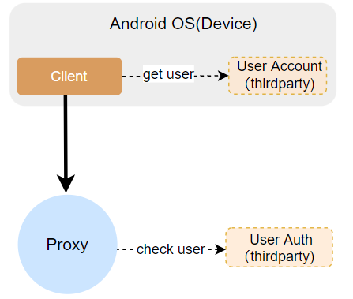

## Third-Party Accounts And Authentication Architecture




CFA supports account and authentication ability for third-party developers. The entire architecture is shown in the above picture. Third-party developers only need to implement the corresponding account service and authentication service according to the following specification. The entire process is roughly as follows:

* The client will request of the third-party account service (User Account component) to obtain the user account information (uid, token) of the local device.
* The client will bring the uid and token information each time it requests the storage proxy service.
* The storage proxy will make request to the third-party authentication service (User Auth component) to authenticate the uid and token, and the stored data can only be accessed after the authentication is passed.
## Protocol Specification

### Http request header

```plain
POST /$URL HTTP/1.1 

Content-Type: application/json or plain/text
X-ReqId: <string>
X-Accesskey: <string>
X-ClientTag：<string>


...<BODY>...
```
* `X-ReqId`  unique request id.
* `X-ClientTag` Client label, default "**CFA**".
* `X-Accesskey` Access key, used by the third-party account service to authenticate the legitimacy of access sources, issued by the third-party developer.
## Request Format

### Request method

* POST：`http://host:port/api`
### Request content

```plain
HTTP/1.1 POST
Content-Type: application/json
# body
eg:
{
    "param1": <string>,
    "param2": <uint32>
}
```
## Response format

```plain
HTTP/1.1 200 OK    
Content-Type: application/json
{
  code: 0,
  msg: ""
  data: {
    "rsp_1": <string>,
    "rsp_2": <int>
  }
}
```
* code:  The specific error code, 0 means success, non-zero means failure.
* msg:   The error details.
* data:   The specific return data content.
## Third-party account components (pull user account information)

### Introduction

The CFA Client will obtain the local device user account information through this interface, and the third-party developer implements the corresponding account service to respond to the Client's interface call, and returns the account association information. Client will periodically fetch user account information. If the account is switched, Client will remount the storage space of the new user.

### Request

```plain
POST /thirdparty/api/user/pullaccount

Content-Type: application/json
{}
```
### Response

```plain
200 {
    "code":0,
    "msg": "success",
    "data":{
        "uid":"test",
        "token":"testtoke"
    }
}
```
* `uid`   The unique id of the user. Third-party developers need to ensure that the user id is globally unique.
* `token` The user access token, the third-party developer defines the token generation rules, validity period, etc. It is recommended that the minimum validity period be > 10s. If it is too small, the token may be expired before the request reaches the server.
## Third-party authentication components (account access authentication)

### Introduction

The Proxy of CFA will authenticate the user account information through this interface, and the third-party developer implements the corresponding authentication service to respond to the interface call of the Proxy and return the authentication result.

### Request

```plain
POST /thirdparty/api/user/check

Content-Type: application/json

{
    "uid": <string>，
    "token": <string>
}
```
* `uid`  The User unique id.
* `token` The User authentication token. 

### Response

```plain
200 {
    "code"：0,
    "msg": "success"
}
```
* `code`:  Return zero means the authentication is successful, non-zero means the authentication fails


